# DevOps Equalizer - Concrete graphical syntax and model to text

## Table of contents

- [DevOps Equalizer - Concrete Graphical Syntax and Model to Text](#devops-equalizer---concrete-graphical-syntax-and-model-to-text)
  - [Table of contents](#table-of-contents)
  - [Introduction](#introduction)
  - [Metamodel](#metamodel)
  - [Concrete Graphical Syntax](#concrete-graphical-syntax)
    - [Pipeline Diagram](#pipeline-diagram)
    - [Task Diagram](#task-diagram)
  - [Model to Text](#model-to-text)
  - [Github Actions Examples: Camel Chess Engine](#github-actions-examples-camel-chess-engine)
    - [Format, Lint and Test](#format-lint-and-test)
      - [Sirius - Pipeline](#sirius---pipeline)
      - [Sirius - Tasks](#sirius---tasks)
      - [Acceleo - Generated Text](#acceleo---generated-text)
    - [Gauntlet](#gauntlet)
      - [Sirius - Pipeline](#sirius---pipeline-1)
      - [Sirius - Task](#sirius---task)
      - [Acceleo - Generated Text](#acceleo---generated-text-1)

## Introduction

This projects aims to model DevOps CI/CD pipelines in an agnostic way, compatible with multiple plaftforms (such as GitHub Actions or Travis CI). The idea is that the user does not need to worry about the concrete syntax of the CI system they intend to deploy their pipelines to, but instead focus on the model of the pipelines themselves; also, they can later switch to a different CI system without having to rewrite their pipelines.

To achieve this, we implemented a graphical syntax to our "DevOps" language with [*Sirius*](https://eclipse.dev/sirius/), and a model to text transformation with [*Acceleo*](https://eclipse.dev/acceleo/).

## Metamodel

Our language's (updated) metamodel is based on the analysis of common CI/CD systems such as GitHub Actions and GitLab Pipelines. We made an effort to include the most common concepts in these systems, and also to make our language extensible so that it can be adapted to other CI/CD systems in the future.

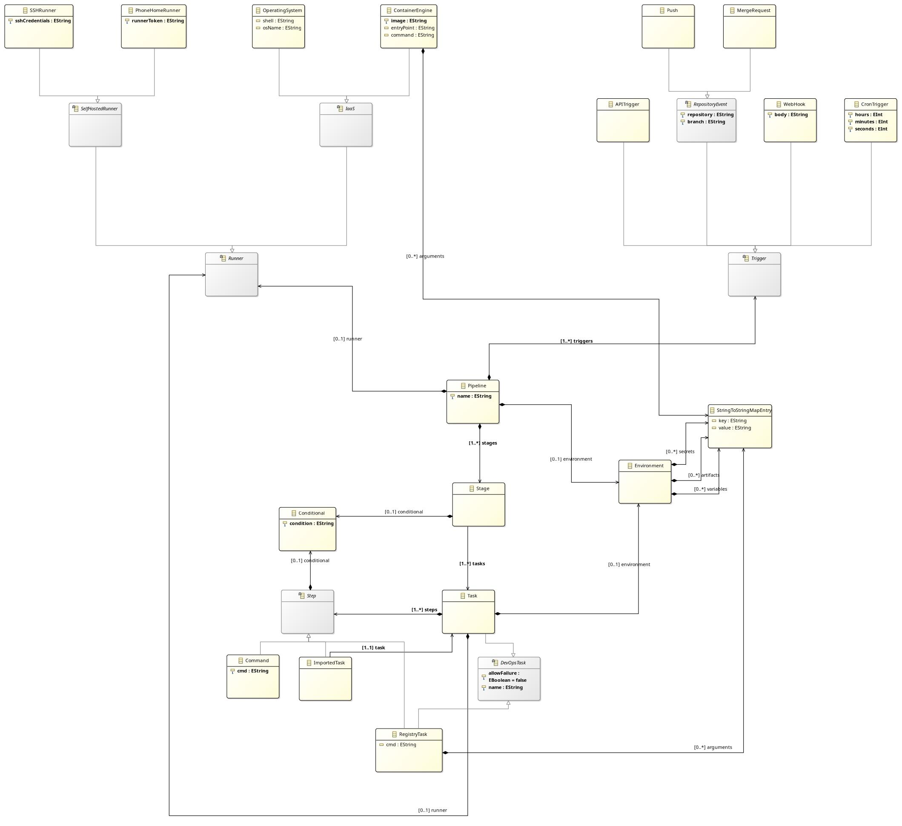

The *Pipeline* is the central unit of our system and represents a CI/CD pipeline. It is triggered by a series of events (*Trigger*) and must run on a specific environment (*Runner*).

A *Pipeline* is composed of a series of *Stage*s, which are executed sequentially. Each *Stage* is composed of a series of *Task*s, which are executed in parallel. A *Task* is an ordered set of *Step*, which can be a *Command*, a *RegistryTask* or an *ImportedTask*. This stage is inspired by Gitlab Pipelines; in other CI systems, its sequential nature can be emulated by stating dependencies between tasks.

A *Pipeline* or a *Task* may contain environment variables, which are then accessible inside its *Command*'s shells.

## Concrete Graphical Syntax
A concrete syntax enables the user to describe the specific model representations using a more intuitive input method. As such, a concrete graphical syntax was implemented using [*Sirius*](https://eclipse.dev/sirius/), an Eclipse project that provides a block based editor for EMF models with relatively low effort.

*Sirius* allows the definition of nodes, containers and edges, used to represent the model entities and relationships. Tools can also be defined to provide additional functionality to the editor, such as the ability to create new elements or to edit existing ones, even leveraging other parts of the Eclipse ecosystem such as dialog editors for data input.

### Pipeline Diagram
In the following table the graphical elements of the pipeline diagram are described. Element properties are shown in the properties view when the element is selected.

| Name | Description | Representation |
| ------- | ----------- | ----- |
| Pipeline container | Holds the pipeline name, triggers and runner | 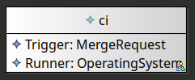 |
| Trigger | Representation of the event that triggers the pipeline. Multiple triggers can be defined |  |
| Runner | Representation of the environment where the pipeline will run, A single runner can be defined at the pipeline level |  |
| Environment | Holds the environment variables, artifacts and secrets at the Pipeline scope | 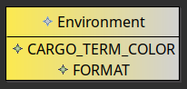 |
| Variable \| Artifact \| Secret | Key-value pair for usage in the pipeline |  |
|StageContainer | Defines a set of parallel tasks | 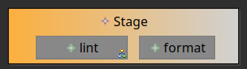 |
| Task | Task representation inside a stage (double-click opens task model editor) |  | 
| (Stage) Conditional | Represents conditions for the stage to run | 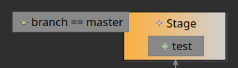 |
| Stage edge | Directed edge between stages representing execution order  | 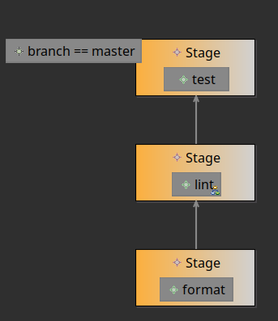 |


### Task Diagram
In the following table the graphical elements of the task diagram are described. Element properties are shown in the properties view when the element is selected.

| Task Diagram | Description | Representation |
| ------- | ----------- | --- |
| Runner | Representation of the environment where the pipeline will run, A single runner can be defined at the pipeline level | 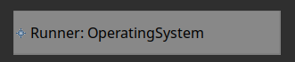 |
| CommandTask \| RegistryTask \| ImportedTask  | Representation of the action to be executed inside a step. A step can only have a single action. |  |
| Environment |  Holds the environment variables, artifacts and secrets at the Task scope | 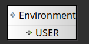 |
| Variable \| Artifact \| Secret | Key-value pair for usage in the task |  |
| (Step) conditional |  Represents conditions for the step to run | 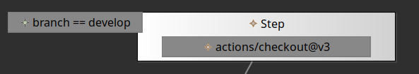 |
| Step edge | Directed edge between steps representing execution order  | 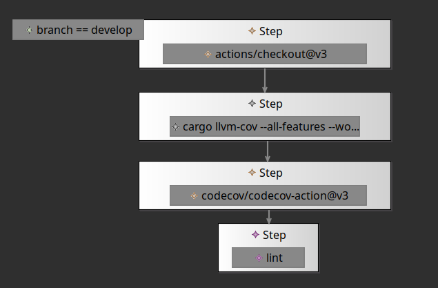 |

## Model to Text

The model to text transformation is done with Acceleo, a code generator that uses the Eclipse Modeling Framework (EMF) to generate code from models.

The implemented model to text transformation generates a YAML file compatible with GitHub Actions:

```
[comment encoding = UTF-8 /]
[module generate('http://www.example.org/examples/devops.ecore')]

[template public generatePipeline(aPipeline : Pipeline)]
[comment @main/]
[file (aPipeline.name.concat('.yml'), false, 'UTF-8')]
name: [aPipeline.name/]

on:
[for (trigger : Trigger | aPipeline.triggers)]
    [trigger.generateTrigger()/]
[/for]
[aPipeline.environment.generateEnvironment()/]
jobs:
[for (stage: Stage | aPipeline.stages)]
    [let previousStage : Stage = if i > 1 then aPipeline.stages->at(i-1) else stage endif]
    [for (task: Task | stage.tasks)]
    [let runAlways : Boolean = i > 1 and (stage.tasks->at(i-1).allowFailure)]
    [task.generateTask(aPipeline, stage, runAlways, previousStage)/]
    [/let]
    [/for]
    [/let]
[/for]
[/file]
[/template]

[template public generateTask(aTask : Task, aPipeline: Pipeline, aStage: Stage,
runAlways: Boolean, previousStage: Stage)]
[comment runner/]
[aTask.name + ':'/]
    [comment environment/]
    [aTask.environment.generateEnvironment()/]
    [comment gh actions are parallel by default, so let us add our sequential stage semantic/]
    [if (previousStage <> null and previousStage <> aStage)]
    needs: ['['/][for (task: Task | previousStage.tasks) separator (', ')][task.name/][/for][']'/]
    [/if]
    [comment run always if previous task allows failure/]
    [if (runAlways)]
    if: always()
    [/if]
    [comment condition/]
    [if (aStage.conditional <> null)]
    if: [aStage.conditional.condition/]
    [/if]
    [comment runner/]
    [if (aTask.runner <> null)]
    runs-on: [aTask.runner.generateRunner()/]
    [/if]
    [if (aTask.runner = null)]
    runs-on: [aPipeline.runner.generateRunner()/]
    [/if]
    steps:
    [for (step: Step | aTask.steps)]
    	[comment registryTasksUse/]
        [if (step.eClass().name = 'RegistryTask')]
        - uses: [step.oclAsType(RegistryTask).name/]
        [if (not step.oclAsType(RegistryTask).arguments->isEmpty())]
          with:
            [for (entry: StringToStringMapEntry | step.oclAsType(RegistryTask).arguments)]
            [entry.key/]: [entry.value/]
            [/for]
        [/if]
        [/if]
    	[comment command/]
		[if (step.eClass().name = 'Command')]
        - run: |
            [step.oclAsType(Command).cmd/]
        [if (step.conditional <> null)]
          if: [step.conditional.condition/]
        [/if]
        [/if]
    [/for]
[/template]

[template public generateEnvironment(aEnvironment: Environment)]
[if (not aEnvironment.variables->isEmpty())]
env:
    [for (entry: StringToStringMapEntry | aEnvironment.variables)]
    [entry.key/]: [entry.value/]
    [/for]
[/if]
[/template]

[template public generateRunner(aRunner: Runner)]
[if (aRunner.eClass().name = 'OperatingSystem')]
[aRunner.oclAsType(OperatingSystem).osName/]
[/if]
[if (aRunner.eClass().name <> 'OperatingSystem')]
self-hosted
[/if]
[/template]

[template public generateTrigger(aTrigger: Trigger)]
[if (aTrigger.eClass().name = 'Push')]
push:
    branches:
        - [aTrigger.oclAsType(Push).branch/]
[/if]
[if (aTrigger.eClass().name = 'MergeRequest')]
pull_request:
    branches:
        - [aTrigger.oclAsType(MergeRequest).branch/]
[/if]
[if (aTrigger.eClass().name = 'APITrigger')]
workflow_dispatch
[/if]
[if (aTrigger.eClass().name = 'WebHook')]
workflow_dispatch
[/if]
[if (aTrigger.eClass().name = 'CronTrigger')]
schedule:
[comment posix cron syntax/]
    cron: "[aTrigger.oclAsType(CronTrigger).hours/] [aTrigger.oclAsType(CronTrigger).minutes/]"
[/if]
[/template]
```

To programatically validate the output YAML files, we used [action-validator](https://github.com/mpalmer/action-validator), a tool that verifies the syntax of GitHub Actions YAML files. Its usage is encapsulated in a `bash` script that our private CI/CD pipeline uses to validate the generated YAML files and greatly simplifies the development process.

## Github Actions Examples: Camel Chess Engine

For this section, we shall present two examples of real-world pipelines that are modelled with our language and then transformed to text with Acceleo.

We used *Camel*, an open-source chess engine, as a case study. We modelled its two main pipelines: the CI pipeline, which runs on every pull request and checks the code's quality, and the Gauntlet pipeline, which runs on every pull request and checks the engine's strength by playing a series of games against the upstream version of the engine.

### Format, Lint and Test

This action is based on the [continuous integration (ci) action](https://github.com/bdmendes/camel/blob/a4b9083abaa0f171d51276e5dce06626c8efecbb/.github/workflows/ci.yml). It is a very common task in software repositories, as it checks the format and style of the code and runs unit and integration tests.

Note that contrary to the original action, we intend each job (in our system, *Task*) to run sequentially, so we encapsulated each job in a stage. In the output text, this is translated to a dependency (needs) between the jobs.

#### Sirius - Pipeline

<p align="middle">
  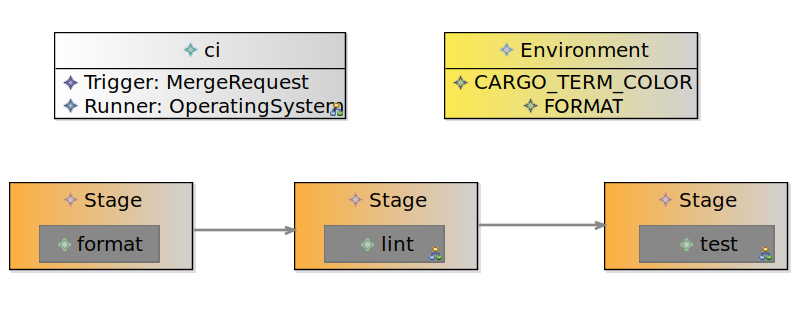
</p>

#### Sirius - Tasks

<p align="middle">
  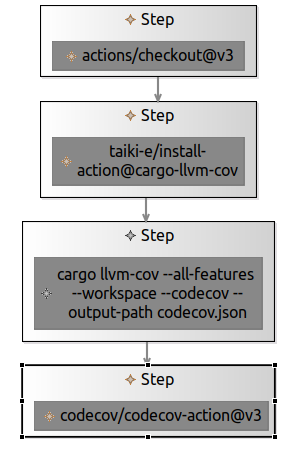
   
  
</p>

#### Acceleo - Generated Text

```yaml
name: ci

on:
    pull_request:
        branches:
            - master
    
env:
    CARGO_TERM_COLOR: always
    FORMAT: true

jobs:
    format:
        env:
            SHFMT_RULESET: 1
        
        runs-on: ubuntu-latest
        
        steps:
            - uses: actions/checkout@v3
            - run: |
                cargo fmt --check
            - run: |
                sudo apt-get install shfmt; shfmt -i 4 -d .
    
    lint:
        env:
            CARGO_TERM_COLOR: always
        
        needs: [format]
        runs-on: ubuntu-latest
        
        steps:
            - uses: actions/checkout@v3
            - run: |
                cargo clippy --verbose -- -D warnings
            - uses: ludeeus/action-shellcheck@2.0.0
    
    test:
        
        needs: [lint]
        runs-on: ubuntu-latest
        
        steps:
            - uses: actions/checkout@v3
              with:
                submodules: true
            - uses: taiki-e/install-action@cargo-llvm-cov
            - run: |
                cargo llvm-cov --all-features --workspace --codecov --output-path codecov.json
            - uses: codecov/codecov-action@v3
              with:
                files: codecov.json
                fail_ci_if_error: true
```

### Gauntlet

This action is based on the [Gauntlet action](https://github.com/bdmendes/camel/blob/a4b9083abaa0f171d51276e5dce06626c8efecbb/.github/workflows/gauntlet.yml). It is a very niche action that matches a feature branch version against the upstream in a series of blitz and rapid chess games. It does so by calling an orchestration script that runs the games and then writes the results to a file, which is then parsed by the action and commented on the pull request. This way, the user can see the results of the games directly on the pull request and decide whether to merge the feature branch or not (if the engine is stronger than the upstream, it is a good candidate for merging).

We did not model the concept of "concurrency" (that GitHub uses to stop a running version of the pipeline when a new version is pushed) because we do not consider it a core concept of a CI/CD pipeline. The same go for job permissions.

Besides this, our generated text is very similar to the original one.

#### Sirius - Pipeline

<p align="middle">
  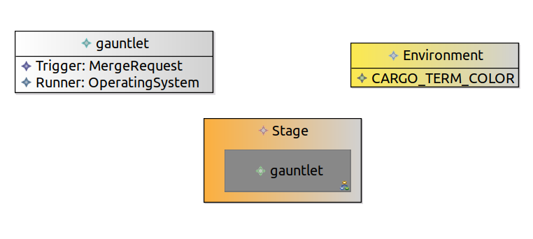
</p>

#### Sirius - Task

<p align="middle">
  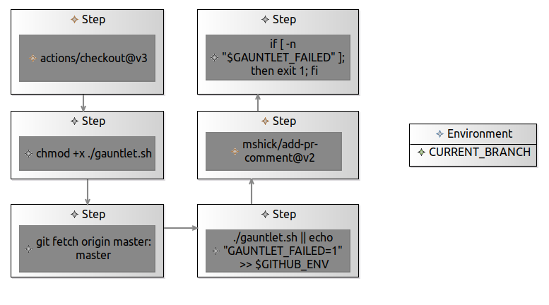
</p>

#### Acceleo - Generated Text

```yaml
name: gauntlet

on:
    pull_request:
        branches:
            - master
    
env:
    CARGO_TERM_COLOR: always

jobs:
    :
        env:
            CURRENT_BRANCH: ${{ github.head_ref }}
        
        runs-on: ubuntu-latest
        
        steps:
            - uses: actions/checkout@v3
              with:
                fetch-depth: 0
            - run: |
                chmod +x ./gauntlet.sh
            - run: |
                git fetch origin master:master
            - run: |
                ./gauntlet.sh || echo "GAUNTLET_FAILED=1" >> $GITHUB_ENV
            - uses: mshick/add-pr-comment@v2
              with:
                message-path: fast-chess/message.txt
            - run: |
                if [ -n "$GAUNTLET_FAILED" ]; then exit 1; fi

```
