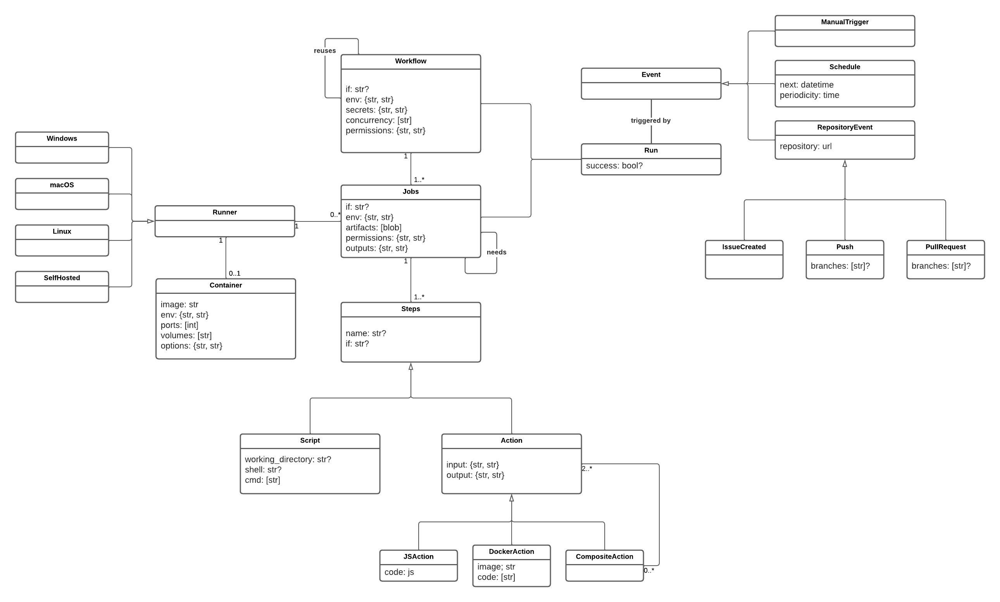
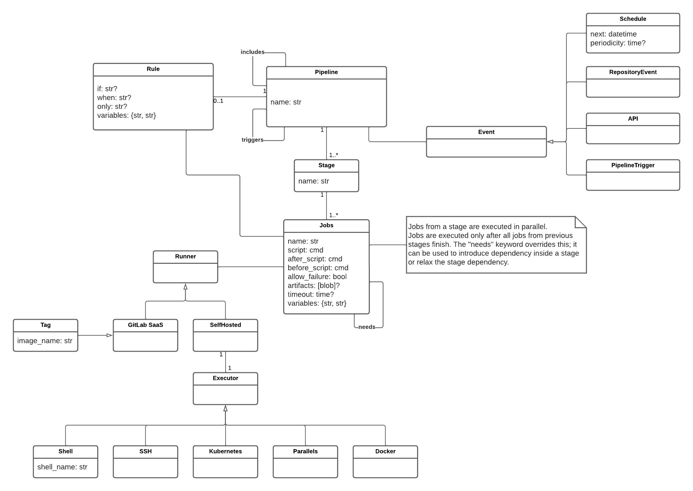
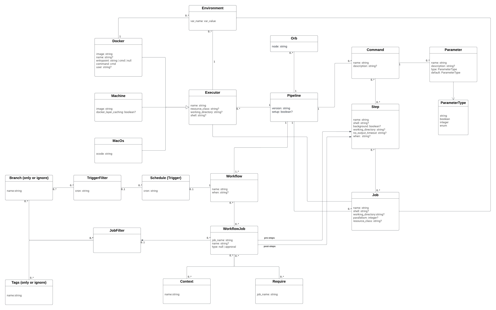
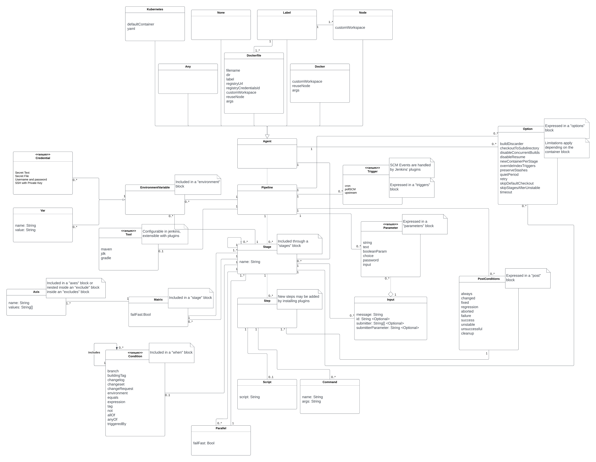

# DevOps Equalizer - Domain analysis and Modelling language design
## Table of contents
1. [Domain analysis](#domain-analysis)
    1. [CI/CD systems inspiring the metamodel](#cicd-systems-inspiring-the-metamodel)
        1. [GitHub actions](#github-actions)
        2. [GitLab Pipelines](#gitlab-pipelines)
        3. [CircleCI](#circleci)
        4. [Jenkins](#jenkins)
    2. [Extracted concepts](#extracted-concepts)
2. [Modelling language design - Metamodel](#modelling-language-design---metamodel)
    1. [Classes](#classes)
    2. [The metamodel](#the-metamodel)

## Domain analysis
To be able to accuratly model the domain of CI/CD pipelines we choose to analyse popular systems and to extract the concepts that are either common to all of them or we find important or interesting to integrate into CI/CD systems. We tried to integrate only features that were supported directly by all the systems or that we knew we could replicate rather easily.

### CI/CD systems inspiring the metamodel
The most popular CI/CD tools are those that are integrated into SCM systems. Apart from tools integrated into such systems we also studied Jenkins which is a standalone CI/CD system.

#### GitHub actions
Being the system that we were more familiar with it was the easier to model and understand.

[

](./resources/analysis-GHActions.png)

#### GitLab Pipelines
Another popular system studyied was GitLab Pipelines. It is a system popular in enterprise environments. 

[

](./resources/analysis-GitLabPipelines.png)

#### CircleCI
[

](./resources/analysis-CircleCI.png)

#### Jenkins
Being a standalone tool it is highly flexible and extensible at the cost of harder configuration and conceptual complexity.

[

](./resources/analysis-Jenkins.png)

### Extracted concepts
| Concept           | Description                                                                                                                               |
| ----------------- | ----------------------------------------------------------------------------------------------------------------------------------------- |
| Trigger           | Metadata about the event that triggered the pipeline run                                                                                  |
| RepositoryEvent   | Metadata of events in a Git-based SCM system                                                                                              |
| Push              | Metadata about pushes made on a Git-based SCM system.                                                                                     |
| MergeRequest      | Metadata about merge request creation or updates on the branch it uses as source on a Git-based SCM system.                               |
| WebHook           | Metadata about the event triggering the pipeline. Event generated by an external entity making a request to the system webhooks endpoint. |
| APITrigger        | Metadata about a manually triggered pipeline run. May be triggered by the user, or other system components.                               |
| CronTrigger       | Metadata of a sheduled pipeline run, using intervals.                                                                                     |
|                   |                                                                                                                                           |
| Runner            | Metadata about the execution environment where tasks will be performed                                                                    |
| SelfHostedRunner  | Runner managed by the user on their own infrastructure, such as on their own servers or virtual machines                                  |
| SSHRunner         | Runner provided by CI/CD platform to perform tasks                                                                                        |
| IaaS              |                                                                                                                                           |
| OperatingSystem   |                                                                                                                                           |
| ContainerEngine   |                                                                                                                                           |
|                   |                                                                                                                                           |
| Environment       | Variables available as both input and output of a pipeline or task.                                                                       |
| Pipeline          | The highest level unit of the CI/CD system. It is trigerred by an event and is composed of several sequential stages.                     |
| Stage             | A set of tasks that can run in parallel.                                                                                                  |
| Task              | Unit composed of sequential explicit steps and/or invoking other tasks.                                                                   |
| Step              | A computational unit, usually a shell script.                                                                                             |
| Conditional       | A boolean operation that may guard the execution of other CI/CD units.                                                                    |
| UnaryConditional  | A conditional with one operand.                                                                                                           |
| BinaryConditional | A conditional with two operands.                                                                                                          |
| Operand           | The evaluation of an environment variable or a conditional.                                                                               |
| LogicOperator     | A logic operator, such as NOT, AND or OR, to be used in conditionals.                                                                     |

## Modelling language design - Metamodel
After compiling the generic concepts relevant for a CI/CD system we built a meta-model using the [EMF Moddeling Tools]() with [OCLinEcore](https://help.eclipse.org/latest/topic/org.eclipse.ocl.doc/help/OCLinEcore.html) tool, a superset of the Ecore language for modelling with support for OCL for constraints and invariants.

### Classes
### The metamodel