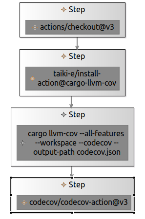
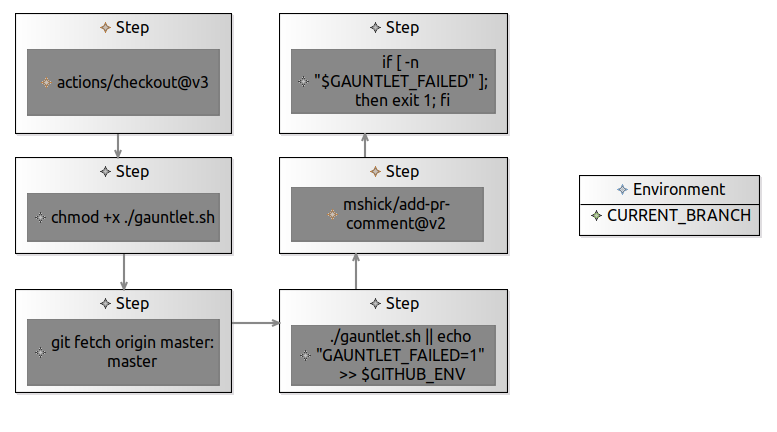

# DevOps Equalizer - Concrete Graphical Syntax and Model to Text

## Table of contents

1. [Concrete Graphical Syntax](#concrete-graphical-syntax)
    1. [Pipeline Diagram](#pipeline-diagram)
    2. [Task Diagram](#task-diagram)
2. [Model to text](#model-to-text)
3. [Github Actions Examples: Camel Chess Engine](#github-actions-examples-camel-chess-engine)
    1. [Format Lint and Test](#format-lint-and-test)
    2. [Gauntlet](#gauntlet)

## Concrete Graphical Syntax

<!-- some bloat -->

### Pipeline Diagram

| Pipeline Diagram | Description |
| ------- | ----------- |
| TaskNode |  |
| StageEdge |  |
| PipelineContainer |  |
| TriggerNode |  |
| PipelineRunnerNode |  |
| StagesContainer |  |
| ConditionalStageNode |  |
| PipelineEnvironmentContainer |  |
| PipelineVariables |  |
| PipelineSecrets |  |
| PipelineArtifacts |  |

### Task Diagram

| Task Diagram | Description |
| ------- | ----------- |
| RunnerNode |  |
| RegestryTaskNode |  |
| CommandNode |  |
| ImportedTaskNode |  |
| StepsEdge |  |
| EnvironmentContainer |  |
| EnvVariable |  |
| EnvSecret |  |
| EnvArtifacts |  |
| StepContainer |  |
| BorderedConditionalNode |  |
| RegistrySub |  |
| CommandSub |  |
| ImportedSub |  |

## Model to text

<!-- some bloat -->

## Github Actions Examples: Camel Chess Engine

<!-- some bloat -->

### Format, Lint and Test 

#### Sirius - Pipeline

<p align="middle">
  
</p>

#### Sirius - Tasks

<p align="middle">
  
   
  
</p>

#### Acceleo - Generated Text

```yaml
name: ci

on:
    pull_request:
        branches:
            - master
    
env:
    CARGO_TERM_COLOR: always
    FORMAT: true

jobs:
    format:
        env:
            SHFMT_RULESET: 1
        
        runs-on: ubuntu-latest
        
        steps:
            - uses: actions/checkout@v3
            - run: |
                cargo fmt --check
            - run: |
                sudo apt-get install shfmt; shfmt -i 4 -d .
    
    lint:
        env:
            CARGO_TERM_COLOR: always
        
        needs: [format]
        runs-on: ubuntu-latest
        
        steps:
            - uses: actions/checkout@v3
            - run: |
                cargo clippy --verbose -- -D warnings
            - uses: ludeeus/action-shellcheck@2.0.0
    
    test:
        
        needs: [lint]
        runs-on: ubuntu-latest
        
        steps:
            - uses: actions/checkout@v3
              with:
                submodules: true
            - uses: taiki-e/install-action@cargo-llvm-cov
            - run: |
                cargo llvm-cov --all-features --workspace --codecov --output-path codecov.json
            - uses: codecov/codecov-action@v3
              with:
                files: codecov.json
                fail_ci_if_error: true
```

### Gauntlet 

#### Sirius - Pipeline

<p align="middle">
  
</p>

#### Sirius - Task

<p align="middle">
  
</p>

#### Acceleo - Generated Text

```yaml
name: gauntlet

on:
    pull_request:
        branches:
            - master
    
env:
    CARGO_TERM_COLOR: always

jobs:
    :
        env:
            CURRENT_BRANCH: ${{ github.head_ref }}
        
        runs-on: ubuntu-latest
        
        steps:
            - uses: actions/checkout@v3
              with:
                fetch-depth: 0
            - run: |
                chmod +x ./gauntlet.sh
            - run: |
                git fetch origin master:master
            - run: |
                ./gauntlet.sh || echo "GAUNTLET_FAILED=1" >> $GITHUB_ENV
            - uses: mshick/add-pr-comment@v2
              with:
                message-path: fast-chess/message.txt
            - run: |
                if [ -n "$GAUNTLET_FAILED" ]; then exit 1; fi

```
